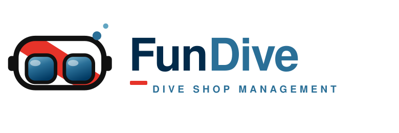

<picture>
  <source media="(prefers-color-scheme: dark)" srcset="./fundive-logo-dark.svg" />
  
</picture>

 

**Free, open-source, self-hostable software for running a scuba dive center.**
Bookings · courses · payments · dive logs · ride & fleet logistics — in one app you host yourself.

 

---

## 🌊 Built for the global scuba community

Every comparable product for running a dive center is paid, closed-source SaaS — locking your
schedule, your revenue, and your customers' data behind a monthly per-seat fee.

**FunDive is different.** It's a gift to the worldwide diving community: clone it, host it, brand
it, and run your entire shop on software you own outright. No license fees. No lock-in. No limits
on how many divers, staff, or trips you manage.

> If you run a dive center anywhere in the world, FunDive is **yours to use, for free, forever.**

## 🐠 What's inside

| | |
| --- | --- |
| 📅 **Booking & scheduling** | Diver-facing calendar with a multi-step registration wizard |
| 💳 **Payments tracking** | Deposit-vs-balance ledger per booking, with refund handling |
| 🚐 **Ride & seat logistics** | Coordinate who rides in which car to the dive site |
| 👨‍👩‍👧 **Group lead-payer billing** | One person books & pays for a whole family or group |
| 🧑‍🏫 **Roles & staff ops** | Diver / staff / admin roles, duty lists, catalog editor |
| 🔔 **Web push notifications** | Booking reminders & admin broadcasts, delivered offline |
| 📱 **Installable PWA** | Mobile-first, installs to the home screen, works offline-ish |

➡️ **Explore the project: [github.com/fundive/fundive](https://github.com/fundive/fundive)**

## 🆓 Free & open source — AGPL-3.0

FunDive is released under the **[GNU Affero General Public License v3.0](https://www.gnu.org/licenses/agpl-3.0)**,
a strong-copyleft license in the GPL family. In plain terms:

- ✅ **Use it for free**, forever, for any dive center — commercial or not.
- ✅ **Study, modify, and self-host** the full source code.
- ✅ **Share your improvements** — the AGPL keeps FunDive (and every fork) open for the whole community.

You own the code. You own your data. The scuba community owns the future of the platform. 🤝

## ⚓ About

FunDive is an **independent, non-profit, open-source project** for the benefit of the dive
community, created and maintained by **Eric Odle** in 2026. It is not owned by or affiliated with
Fun Divers Taiwan or any other organization. [Fun Divers Taiwan](https://www.fundiverstw.com), a dive
shop in Taipei, helped field-test the app in real shop operations as a way to give back to the
community.
